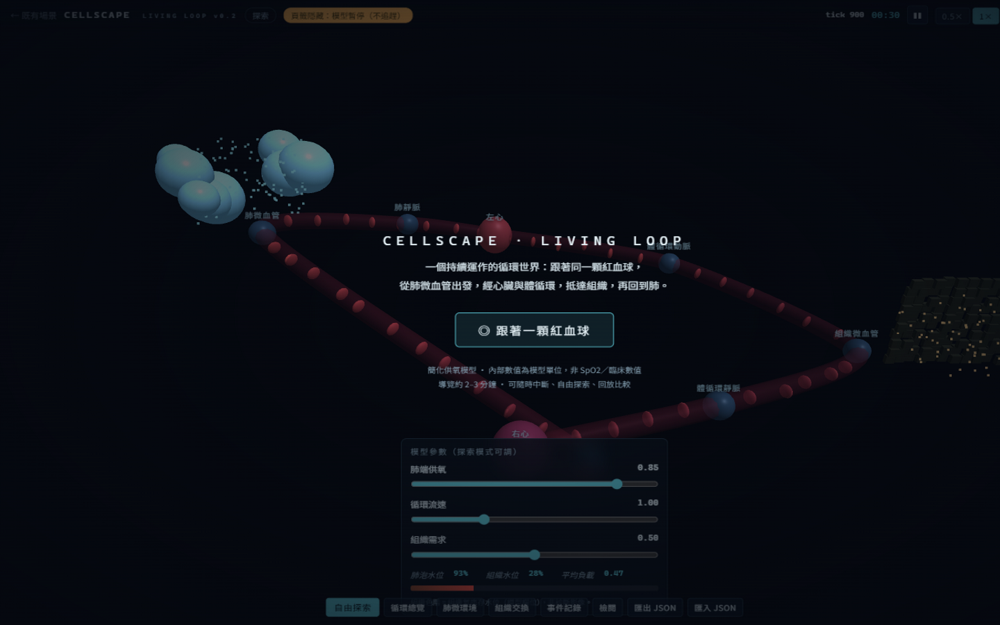

# CELLSCAPE · Living Atlas

**跟著同一顆紅血球，從肺微血管出發，經心臟與體循環，抵達組織，再回到肺。**

產品 **0.5.0**。簡化供氧模型；內部數值是模型單位，不是 SpO₂，也不是臨床指標。

**[打開線上圖譜](https://taipei49314.github.io/cellscape/)** · 不用安裝，按「跟著一顆紅血球」。



## 八分鐘

1. 按「跟著一顆紅血球」。
2. 看它在肺裝載、在組織卸載。
3. 切到自由探索，拉低「肺端供氧」（或提高「貧血程度」）。
4. 等組織水位變化後，切 A/B，用自己的話講「誰造成誰」。

可隨時中斷導覽。空白的曲線表示沒有觀測，不能讀成零。

學習章節（A 跟隨 → B 自己改條件 → C 回放比較）不會替你動滑桿，也不評對錯。五人小樣本腳本見 [docs/TRY.md](docs/TRY.md)；尚未由人類跑完，所以**不宣稱學習成效**。

## 本機

Windows：雙擊 `start.bat`（或 `.\start.ps1`）。其他環境：

```sh
python -m http.server 8642 --bind 127.0.0.1
```

然後打開 [http://127.0.0.1:8642/loop.html](http://127.0.0.1:8642/loop.html)。無建置步驟；Three.js 已隨附。

根路徑 `/` 進入 Living Atlas。舊的八個 Canvas 場景在 [museum.html](museum.html)，與這個世界**不共用模擬狀態**。

## 這不是什麼

- 不是臨床模型，也不是全身模擬。
- 氧庫存、負載、速率都未校準成生理單位。
- 舊八景是獨立展示，不是這個連動世界的一部分。

## 檢查

```sh
npm test
```

隨包 47 項 scoped check。瀏覽器驗收由 CI 跑，不是實機或跨瀏覽器成績。生物學有效不在這份檢查裡。

模型單位與已知限制：[docs/LOOP-NOTES.md](docs/LOOP-NOTES.md)。

## 授權

原始碼在 GitHub 公開可見，**未另行授予開源授權**（可見 ≠ 可以改、可以再散布）。Vendor [Three.js](vendor/THREE-LICENSE.txt) 維持其 MIT。
